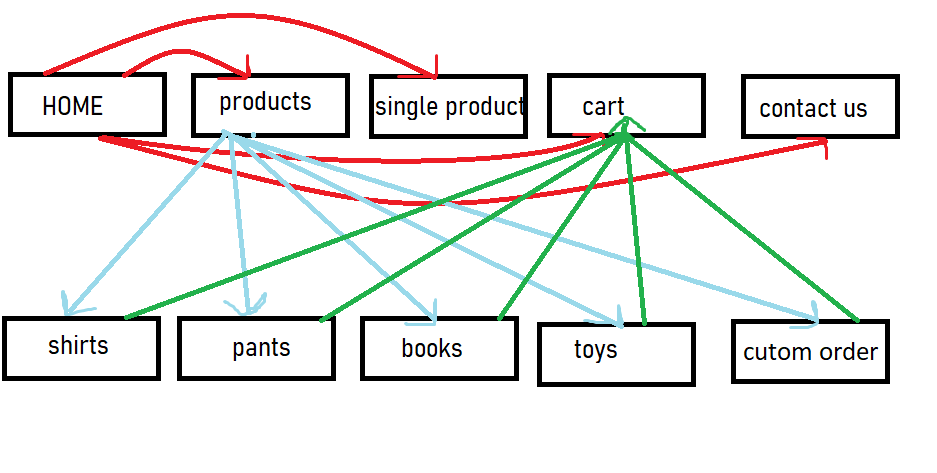
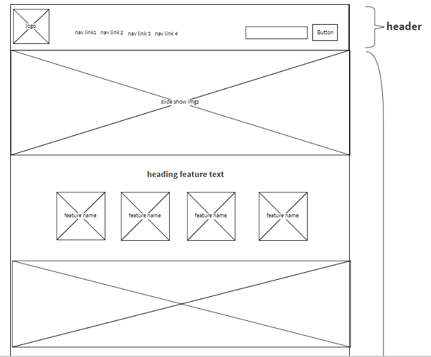
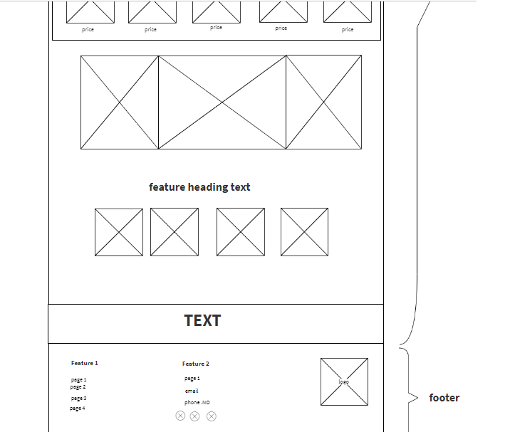
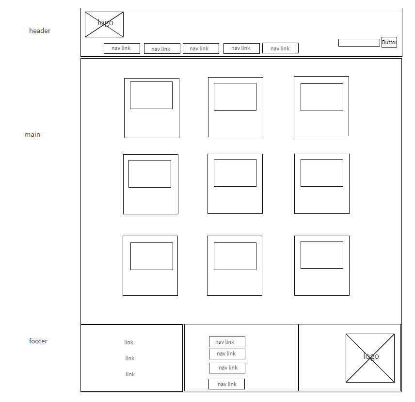
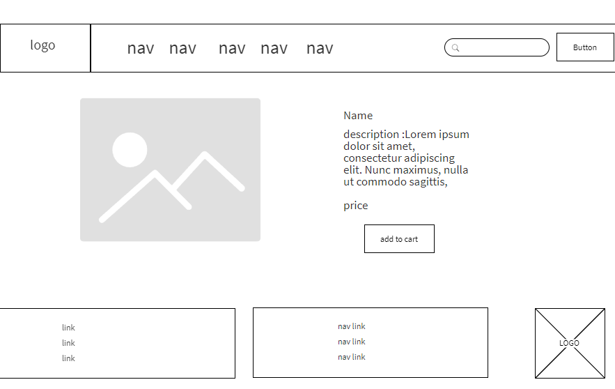
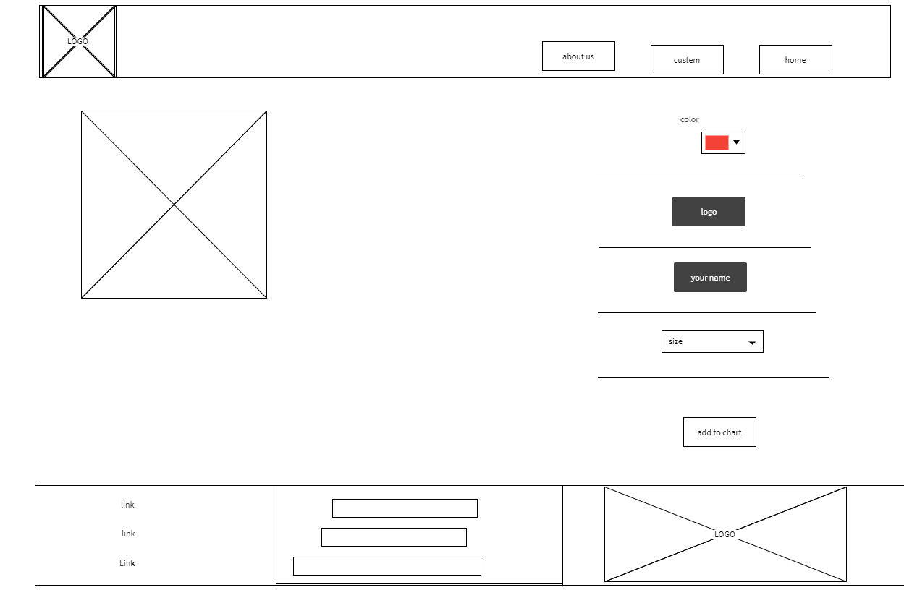
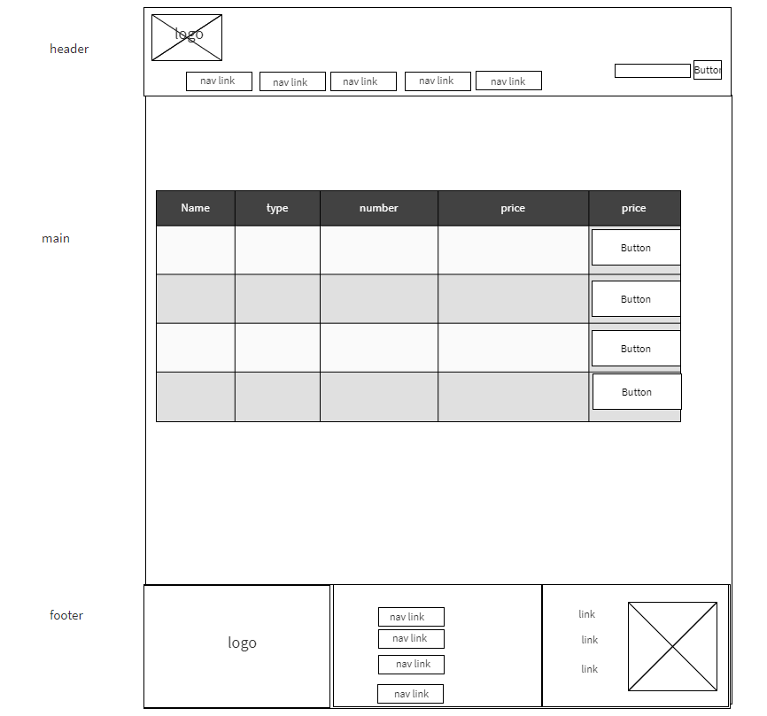
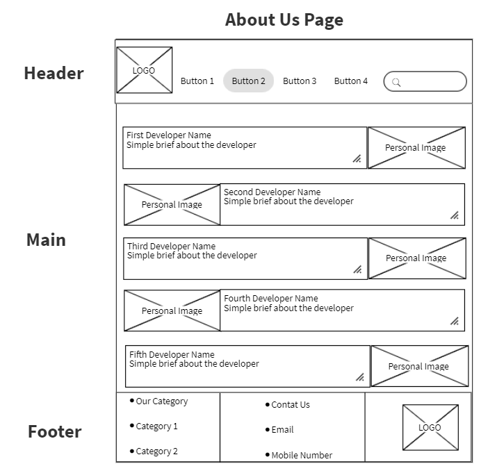

# Matjarcom-Repo
We will have e-commercial page to sale children related items  (cloths, toys accessories), It will be a place that the buyers will find all of the children requirements, that sorted based on ages, gender and brands, with details for each product. We want to allow them to choose the details of their product. We let them have their items in their cart. Also, our page will have image map that clarify the locations of our branches. 

# Group Members: 
### Bara'ah Bsharat 
### Malek Branch
### salim nihad raji 
### Aya Alasmar
### suhaib emad

# User Stories
* As a user I want to see the most essiential clothes for my child with appropriate price, so that I will  visit your cite.
tasks features:
The user can see all of the available clothes
The user can choose his favourite cloth
The user can add it into a buy cart
The user can see all of the chosen item
The user  can remove anyone he/she want from the cart 
The user can know the nearesest branch and when the clothes will be arrived

* As a user I want to choose my own design and colors for my favourit shirt or mug before buying it for my child with appropriate price, so that I will visit your cite.
tasks features:
The user can choose either mug or t-shirt.
The user can he/she can modify the product style including its colors, names or logos.
The user can add the chosen product to the cart
The user  can remove anyone he/she want from the cart 

* As a user I want to listen to the toys voice before buying it so that I will visit your cite.
 The user can choose a toy which have a voice
 The user can display the toy voice and listen to it before buying
 The user can add the product to the cart 
 The user  can remove anyone he/she want from the cart 

* As a user I want to see the best offers products with discounts on the home page.
The user can choose his favourit products from the offers that presented on the home page 
The user can see the description of each product in the product page if he/she choose it

* As a user I want to choose the appropriate book for my child by skimming it's content before buying it. 
The user can choose the book that displayed with its name and cover 
The user can read a breif description about the book before buying it 
 The user can add the product to the cart 
 The user  can remove anyone he/she want from the cart 

* As a user I want to see pretty, interactive and simple design for the web page. 
The user can see clear image for the products 
The user can read an aprropriate description about the product 
The user can listen to the voice of the products he/she wants

# Domain Modeling 

# Our project wireframes 
 # for the home page 

 
 # for products page
 
 # For single product page 
 
 # for custom products  
 
 # for buy cart 
 
 # for About us page 
 
